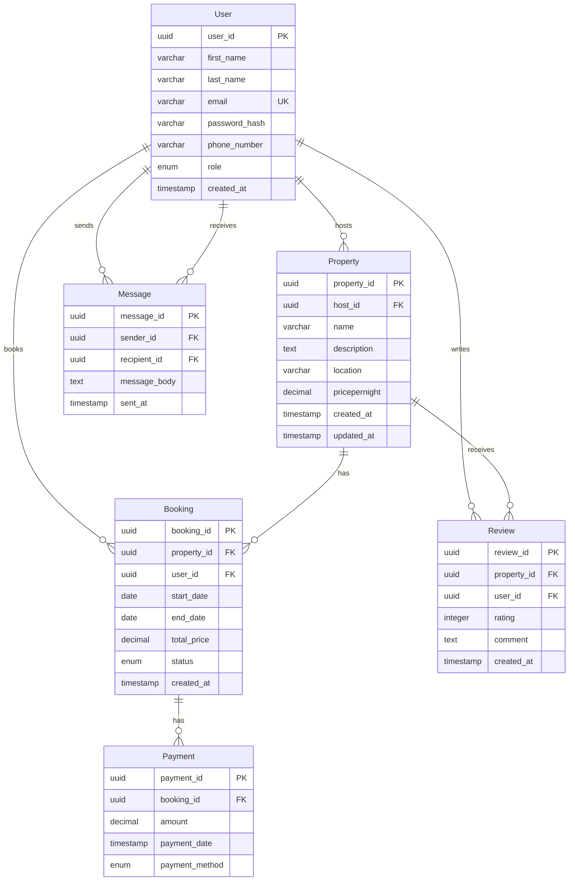

ER Diagram for Airbnb Database

This ER diagram represents the structure and relationships of the core entities in our Airbnb-like application.

## Entities
- User
- Property
- Booking
- Payment
- Review
- Location

## Relationships
- A user can have many bookings.
- A user can own multiple properties.
- A booking belongs to a user and a property.
- Each booking has one payment and one review.
- Each property is linked to a location.

## ERD
[ER Diagram](./ERD/ER%20Diagram.png)

## Entity Relationship Diagram

## Detailed Entity Descriptions

### User Entity
- **Primary Key**: `user_id` (UUID)
- **Unique Constraint**: `email`
- **Role Types**: guest, host, admin
- **Relationships**: 
  - One-to-Many with Property (as host)
  - One-to-Many with Booking (as guest)
  - One-to-Many with Review (as reviewer)
  - One-to-Many with Message (as sender/recipient)

### Property Entity
- **Primary Key**: `property_id` (UUID)
- **Foreign Key**: `host_id` → User.user_id
- **Relationships**:
  - Many-to-One with User (host)
  - One-to-Many with Booking
  - One-to-Many with Review

### Booking Entity
- **Primary Key**: `booking_id` (UUID)
- **Foreign Keys**: 
  - `property_id` → Property.property_id
  - `user_id` → User.user_id
- **Status Types**: pending, confirmed, canceled
- **Constraints**: end_date > start_date
- **Relationships**:
  - Many-to-One with Property
  - Many-to-One with User (guest)
  - One-to-Many with Payment

### Payment Entity
- **Primary Key**: `payment_id` (UUID)
- **Foreign Key**: `booking_id` → Booking.booking_id
- **Payment Methods**: credit_card, paypal, stripe
- **Relationships**:
  - Many-to-One with Booking

### Review Entity
- **Primary Key**: `review_id` (UUID)
- **Foreign Keys**:
  - `property_id` → Property.property_id
  - `user_id` → User.user_id
- **Constraints**: rating between 1-5
- **Relationships**:
  - Many-to-One with Property
  - Many-to-One with User (reviewer)

### Message Entity
- **Primary Key**: `message_id` (UUID)
- **Foreign Keys**:
  - `sender_id` → User.user_id
  - `recipient_id` → User.user_id
- **Relationships**:
  - Many-to-One with User (sender)
  - Many-to-One with User (recipient)

## Key Features

### Cardinality
- **One-to-Many**: User → Property (one user can host many properties)
- **One-to-Many**: Property → Booking (one property can have many bookings)
- **One-to-Many**: Booking → Payment (one booking can have multiple payments)
- **One-to-Many**: User → Review (one user can write many reviews)
- **Many-to-Many**: User ↔ User (through Message entity for messaging)

### Constraints
- **Referential Integrity**: All foreign keys with CASCADE delete
- **Data Validation**: Rating (1-5), dates (end > start), unique emails
- **Business Rules**: Role-based access, booking status management

### Indexes
- Primary keys (automatic)
- Foreign keys for join performance
- Email for user authentication
- Date ranges for booking queries
- Composite indexes for common query patterns 